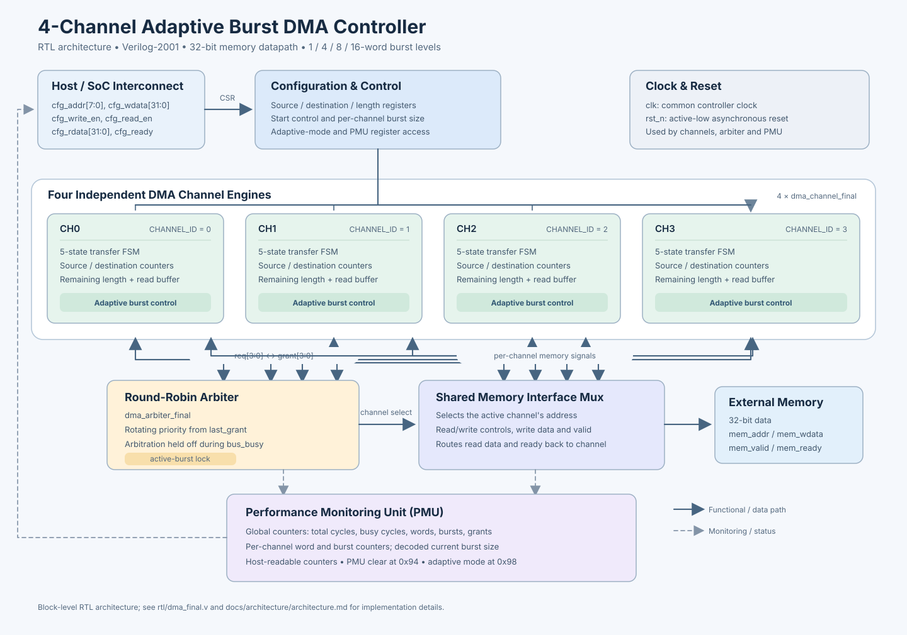

# 4-Channel Adaptive Burst DMA Controller

A Verilog-2001 DMA controller with four transfer channels, round-robin arbitration, adaptive burst-length selection, and memory-mapped performance counters.

The design explores a practical SoC trade-off: **larger bursts can reduce arbitration overhead, while shorter bursts can improve sharing of a common memory interface.** The controller supports fixed-burst operation as a comparison mode.

## Architecture



The top-level module is `dma_final`. It connects the host configuration interface, four channel engines, arbitration and shared-memory selection logic, and the performance monitoring unit (PMU).

### Hardware blocks

| Block | RTL module / logic | Responsibility |
|---|---|---|
| Top-level integration | `dma_final` | Configuration registers, channel integration, memory interface selection, and PMU |
| DMA channel engine ×4 | `dma_channel_final` | Per-channel FSM and datapath; source/destination address tracking, transfer length, read-data buffer, and burst control |
| Arbiter | `dma_arbiter_final` | Rotating-priority arbitration among channel requests, with active-burst locking |
| Adaptive burst controller | Inside each `dma_channel_final` | Adjusts a channel's burst level at transfer-burst boundaries |
| Performance monitoring | Inside `dma_final` | Counts cycles, busy cycles, words, completed bursts, grants, and per-channel transfer activity |

## Transfer datapath

Each channel uses a five-state FSM:

`IDLE → BURST_REQ → READ_WAIT → WRITE_WAIT → … → DONE_STATE`

1. Software writes a channel's source address, destination address, and transfer length through the configuration interface.
2. The channel requests the shared memory interface. The round-robin arbiter selects a requesting channel when the bus is not locked by an active burst.
3. The selected channel reads one 32-bit word from the source address, buffers it, then writes it to the destination address.
4. A word transfer advances both addresses by four bytes and decrements the remaining word count when the memory handshake completes.
5. The channel completes the burst or transfer, then returns to arbitration as required.

The memory-side handshake uses `mem_valid` and `mem_ready`. The host configuration interface uses `cfg_addr`, `cfg_wdata`, `cfg_write_en`, `cfg_read_en`, `cfg_rdata`, and `cfg_ready`.

## Adaptive burst selection

Each channel supports burst levels corresponding to **1, 4, 8, or 16 words**. In adaptive mode, an efficiency score is updated at burst boundaries; the score thresholds can increase or decrease the selected burst level. Burst length is constrained by the remaining transfer length to avoid requesting more words than remain in the transaction.

The `ADAPTIVE_MODE` register at `0x98` selects adaptive operation or fixed-burst baseline mode. This provides a way to compare simulated workloads under the two policies using the PMU.

## Design summary

| Item | Description |
|---|---|
| RTL language | Verilog-2001 |
| Top module | `dma_final` |
| Channel engine | `dma_channel_final` (four instances) |
| Arbiter | `dma_arbiter_final` |
| Data path | 32-bit word transfers |
| Burst lengths | 1 / 4 / 8 / 16 words |
| Reset | Active-low asynchronous reset |
| Memory handshake | `mem_valid` / `mem_ready` |
| Configuration | 8-bit address, 32-bit data interface |
| Verification | Self-checking Verilog testbench is provided |
| Implementation status | RTL and flow scripts are present; check generated tool reports before quoting synthesis or physical-design PPA |

## Simulation and evaluation

The repository includes a self-checking testbench and workload comparison files. Treat the benchmark numbers as **simulation results for the included test setup**, not as ASIC power, area, or timing results.

- [Verification plan](docs/verification/verification_plan.md)
- [Verification architecture](docs/verification/verification_architecture.md)
- [Benchmark results](simulation/results/benchmark_results.md)
- [Raw benchmark data (CSV)](simulation/results/benchmark_results.csv)
- [Synthesis summary and flow notes](synthesis/reports/synthesis_summary.md)

Do not interpret functional simulation passing as timing closure or physical-design signoff. No ASIC area or power result should be reported unless backed by a generated synthesis or implementation report.

## Register map

Each channel has source-address, destination-address, transfer-length, control, and burst-size configuration. The PMU exposes global and per-channel counters, a clear control, and adaptive-mode selection.

See the [complete register map](docs/registers/register_map.md) for addresses, access types, and field definitions.

## Repository layout

```text
rtl/             Synthesizable controller RTL
tb/              Self-checking testbench
docs/
  architecture/  Architecture description and diagrams
  registers/     Register map
  verification/  Verification plan and testbench structure
  design_notes/  Adaptive-burst design notes
simulation/
  results/       Verification summary and benchmark data
  logs/          Simulation logs
synthesis/
  scripts/       Yosys, Vivado, and Quartus flow scripts
  constraints/   Timing constraints
  reports/       Synthesis-flow notes and reports
images/
  architecture/  Architecture and FSM diagrams
  simulation/    Simulation and benchmark visuals
scripts/         Simulation launch scripts
```

## Run a simulation

The provided scripts are intended for environments with the relevant simulator installed.

**Windows (ModelSim / Questa):**
```cmd
scripts\\run_sim_modelsim.bat
```

**Linux (ModelSim / Questa):**
```bash
chmod +x scripts/run_sim_modelsim.sh
./scripts/run_sim_modelsim.sh
```

For manual execution, compile `rtl/dma_final.v` and `tb/tb_dma_final.v` in your simulator, then run the `tb_dma_final` testbench to completion.

## Author

**Allen Joe A**  
B.Tech. Electronics and VLSI Engineering  
Vellore Institute of Technology, Chennai

## License

Released under the [MIT License](LICENSE).
