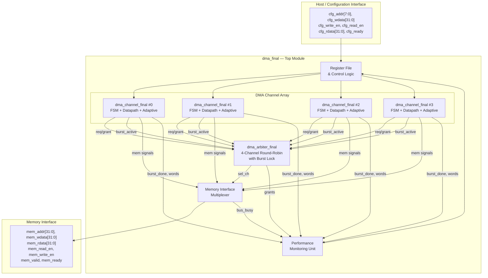
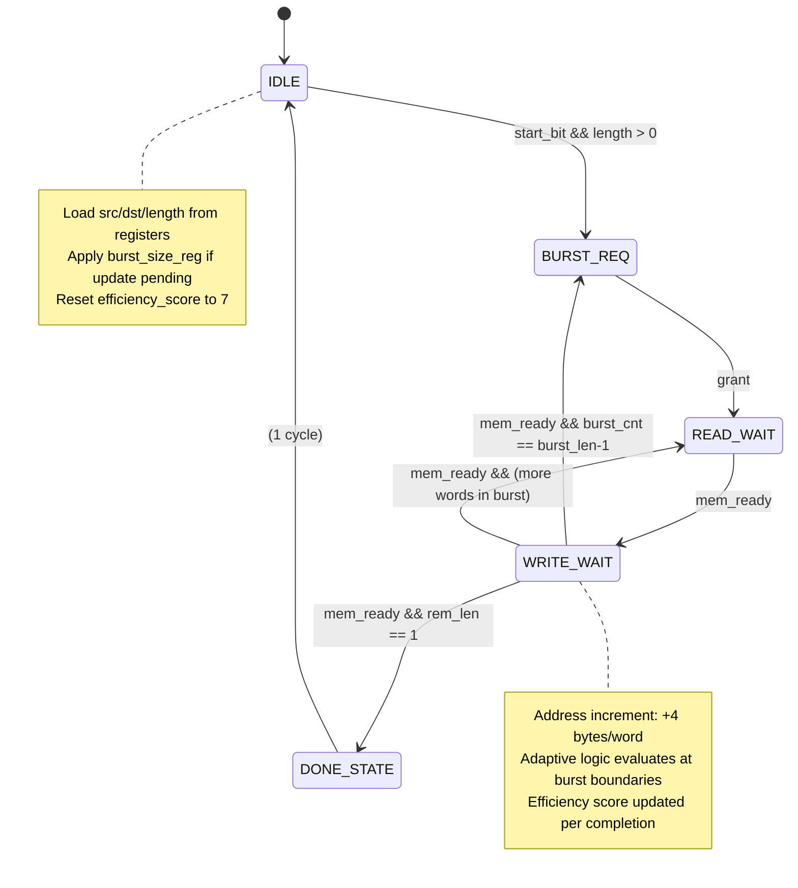
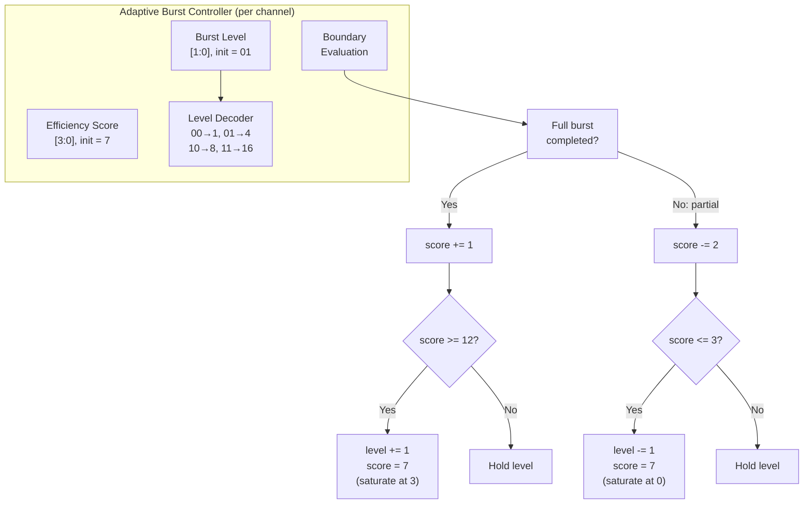
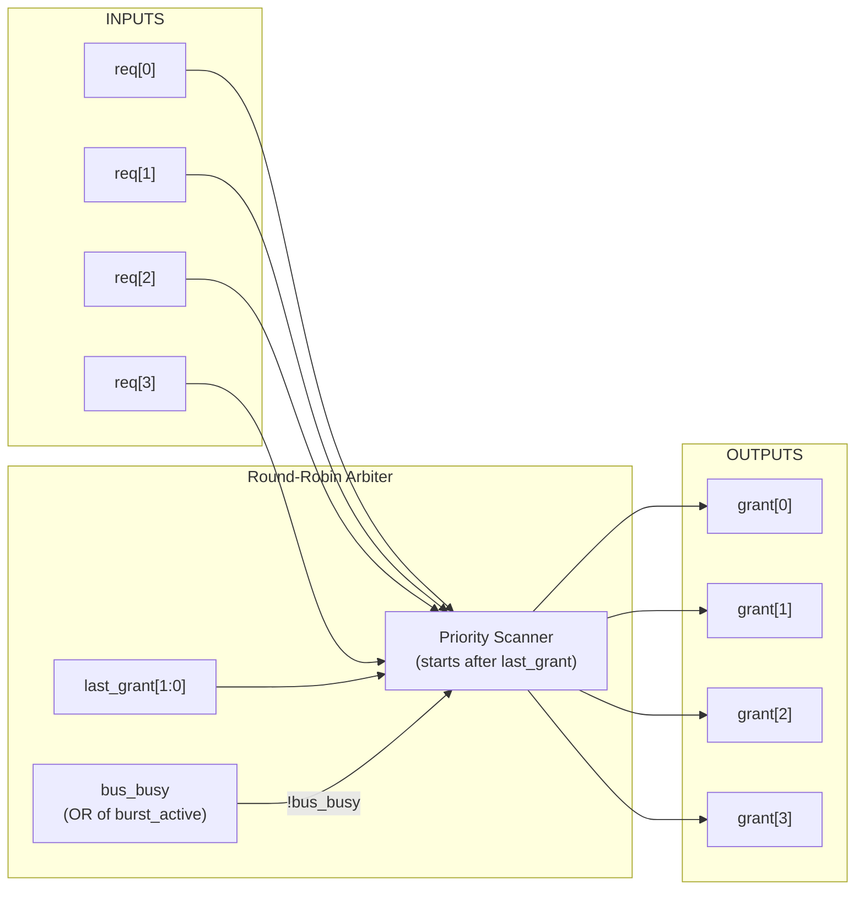

# DMA Controller Architecture

## Top-Level Block Diagram



## Channel FSM State Diagram



## Adaptive Burst Controller Detail



## Arbiter Architecture



## Memory Interface Timing

```
         ┌──┐  ┌──┐  ┌──┐  ┌──┐  ┌──┐  ┌──┐  ┌──┐  ┌──┐
  clk    │  │  │  │  │  │  │  │  │  │  │  │  │  │  │  │
       ──┘  └──┘  └──┘  └──┘  └──┘  └──┘  └──┘  └──┘  └──

         ┌─────────┐                 ┌─────────┐
  req    │         │                 │         │
       ──┘         └─────────────────┘         └───────────

               ┌────┐                     ┌────┐
  grant        │    │                     │    │
       ────────┘    └─────────────────────┘    └───────────

                    ┌─────────┐                ┌──────────
  mem_valid         │  READ   │  ┌─WRITE──┐    │  READ
       ─────────────┘         └──┘        └────┘

                         ┌────┐       ┌────┐        ┌────
  mem_ready              │    │       │    │        │
       ──────────────────┘    └───────┘    └────────┘

  Phase:  IDLE | BURST_REQ | READ_WAIT | WRITE_WAIT | READ_WAIT ...
```

## Data Flow per Word Transfer

```
  Source Memory              DMA Channel              Destination Memory
  ┌──────────┐            ┌──────────────┐            ┌──────────┐
  │          │  READ      │              │  WRITE     │          │
  │ mem[src] │──────────→ │ read_data_buf│──────────→ │ mem[dst] │
  │          │  mem_ready │              │  mem_ready  │          │
  └──────────┘            │ src += 4     │            └──────────┘
                          │ dst += 4     │
                          │ rem_len -= 1 │
                          │ burst_cnt += 1│
                          └──────────────┘
```
