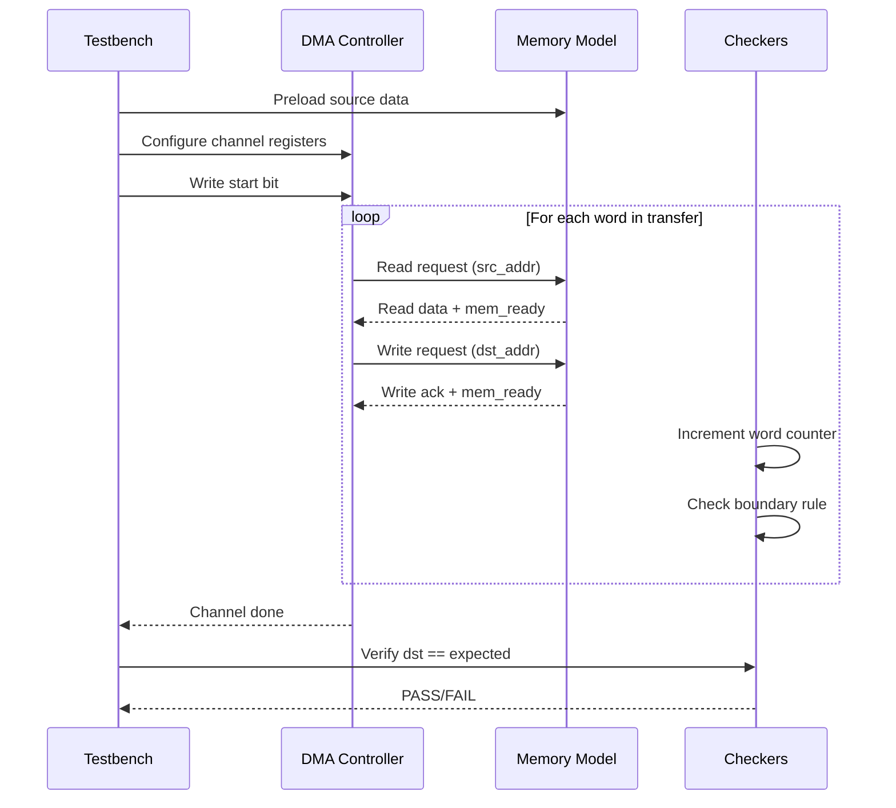

# Verification Architecture

## Testbench Block Diagram

```mermaid
graph TB
    subgraph TB["tb_dma_final — Verification Environment"]
        CLK["Clock Generator<br/>100 MHz (10ns period)"]
        RST["Reset Controller<br/>Async active-low"]
        
        subgraph STIM["Stimulus Generation"]
            REG_WR["Register Write Task<br/>(reg_write)"]
            REG_RD["Register Read Task<br/>(reg_read)"]
            PRELOAD["Memory Preload Tasks<br/>(preload_mem, preload_mem_pattern)"]
            START["Channel Start Task<br/>(start_channel)"]
        end

        DUT["DUT: dma_final<br/>4-Channel DMA Controller"]

        subgraph MEM_MODEL["Memory Model"]
            MEM["64K x 32-bit Array<br/>(mem_store[0:65535])"]
            HANDSHAKE["1-cycle Ready Handshake"]
        end

        subgraph CHECKERS["Checkers & Monitors"]
            VERIFY["Data Verification<br/>(verify_transfer)"]
            LEN_CHK["Length & Overrun Checker<br/>(test_length_corner)"]
            BOUND["Boundary Rule Monitor<br/>(continuous assertion)"]
            DONE_MON["Channel Done Monitor<br/>(ch_done_latched)"]
            WORD_MON["Word Write Counter<br/>(check_count)"]
            ADAPT_MON["Adaptive Burst Tracker<br/>(check_adaptive_changes)"]
        end

        subgraph BENCH["Benchmark Engine"]
            BM_RUN["Benchmark Runner<br/>(run_single_benchmark)"]
            BM_BL["Baseline Mode<br/>(adaptive_en = 0)"]
            BM_AD["Adaptive Mode<br/>(adaptive_en = 1)"]
            PMU_RD["PMU Counter Readback"]
        end

        subgraph ACCT["Test Accounting"]
            PASS["pass_count"]
            FAIL["fail_count"]
            CATS["Category Flags<br/>(13 categories)"]
        end
    end

    CLK --> DUT
    RST --> DUT
    STIM --> DUT
    DUT --> MEM_MODEL
    MEM_MODEL --> DUT
    DUT --> CHECKERS
    MEM_MODEL --> CHECKERS
    CHECKERS --> ACCT
    BENCH --> DUT
    DUT --> BENCH
```

## Test Flow Sequence

## Continuous Monitors

| Monitor               | Type        | Checks                                          |
|----------------------|-------------|--------------------------------------------------|
| Boundary Rule        | Concurrent  | Burst level never changes during active burst    |
| Word Write Counter   | Concurrent  | Counts every valid+ready+write_en cycle          |
| Done Latch           | Concurrent  | Latches channel done signals for polling         |
| Adaptive Tracker     | Polled      | Reads current burst size registers between tests |
